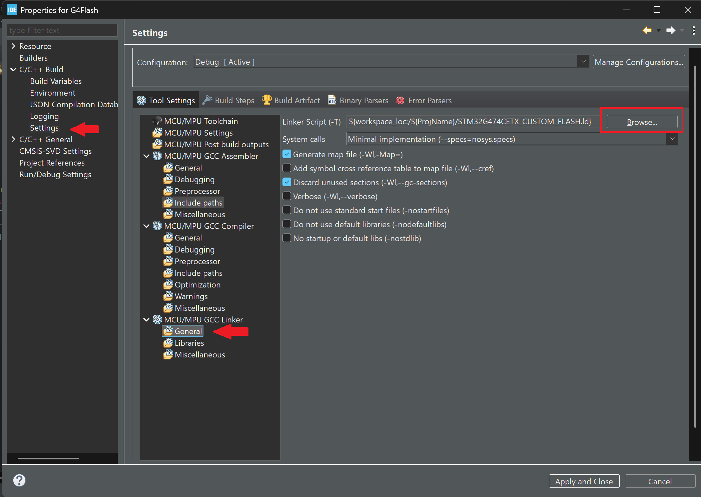

# Flash programming on G4 series chips

The G4 series chips (used in the sensor units of the car) use a less advanced construction so you will need to modify the linker script by hand.

First you need to generate code (if you haven't) from the .ioc file. This will create 2 linker scripts, one for the RAM memory and one fro the Flash. Create a copy of the xx_FLASH.ld file and name it something so that it won't interfere with the original (like xx_CUSTOM_FLASH.ld).

To actually create space in the flash memory you will need to modify the following part of the linker script (it is near the top) like this:

(Note: You can name the created space anything, this is for testing purposes only)

```C
/* Memories definition */
MEMORY
{
  RAM    (xrw)     : ORIGIN = 0x20000000,  LENGTH = 128K
  FLASH    (rx)    : ORIGIN = 0x8000000,   LENGTH = 512K-4K
  DATA_FLASH (rx)  : ORIGIN = 0X807F000,   LENGTH = 4K
}
```

To tell the IDE to use the custom linker script you made, you will need to head into the properties of the project (either right click and properties, or alt+enter on the project folder). 

Head to the C/C++ Build settings, and go to the Linker section then general. Click on browse and select your custom linker script, so the IDE uses this script (Note: If you don't see the browse button then extend the window).



To know more about the Debug configrations, read the description in the FSU_RSU folder on the FSU-RSU-CsMate branch in the electronics repository.