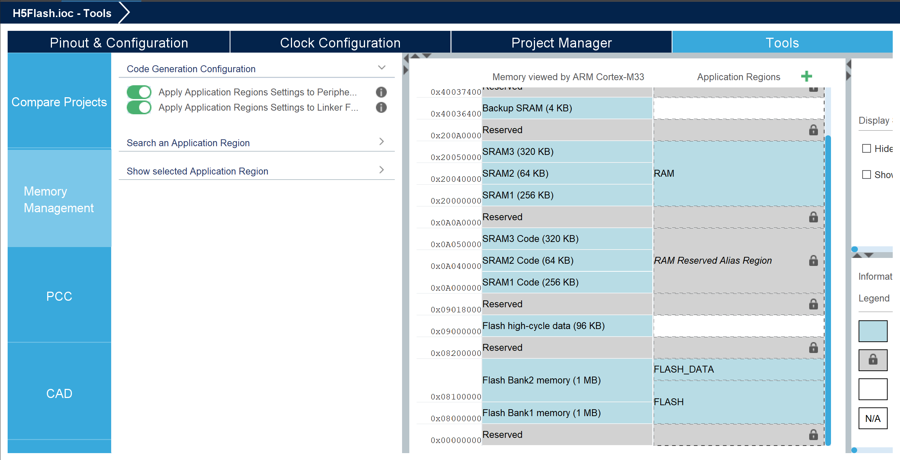

# Flash programming on H5 series chips

Unlike the G4 chips, the H5 series actually lets you use the bulit in features of memory management in the IDE. 

To do this, open the .ioc file and go to the "Tools" tab and go to the "Memory management" tab.

Here you will see the following:

Click on the sector labeled "FLASH" and decrease the 2048kb size with the desired amount (here it is 16kb). A "+" symbol will appear above the "FLASH" sector. Create the sector, and name it whatever (here it's "FLASH_DATA").

The size is automatically set, you only need to change the access permission to "RW by privileged code" to be accessible for our code.

Now press Alt+k to generate code. This change will generate a new linker script (here it is named xx_FLASH_MMT_TEMPLATE.ld). The IDE will ask to set this as the active linker script. Click yes and you're done.