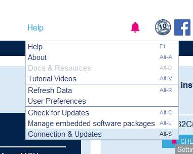
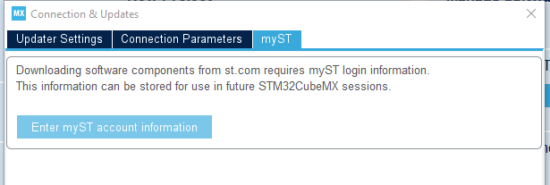
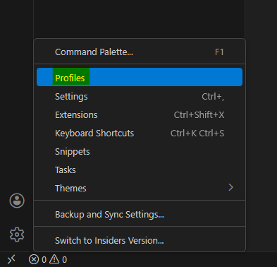
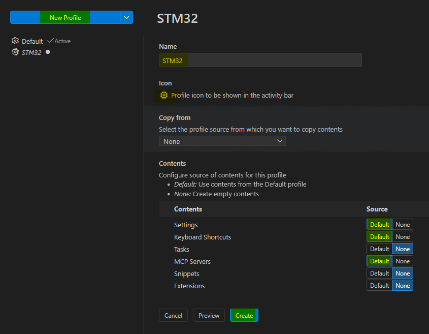
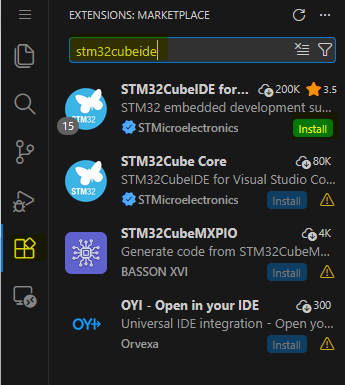
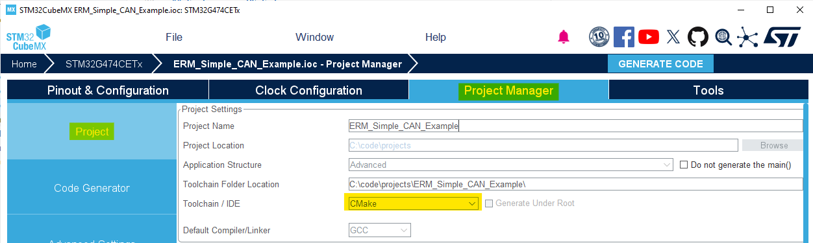
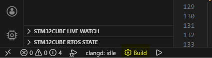
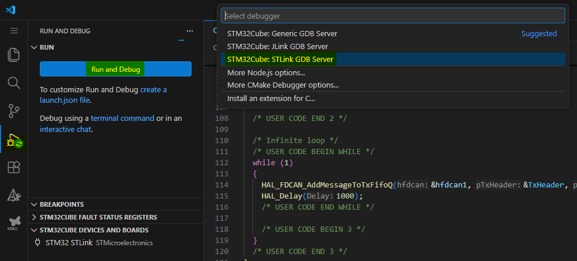

# STM32 development with VS Code

This is a quick tutorial on how to setup VS Code to work with STM32.

## Installing software

Download and install the following software:

- [VS Code](https://code.visualstudio.com/download)
- [STM32CubeMX](https://www.st.com/en/development-tools/stm32cubemx.html)

## Configuring STM32CubeMX

Open CubeMX and in the menu bar click `Help` > `Connection & Updates` \

Then click `myST` > `Enter myST account information` \

Log into your ST account.

## Configuring VS Code

Before installing extensions, I recommend creating a separate VS Code profile to use for STM32 development. \
The STM32 extension pack can slow down the editor. If you create a separate profile, VS Code can remain fast for other kinds of usage.

### Creating VS Code profile

To create a profile, click the Manage button in the bottom left (usually gear icon) and then click `profiles` \

Then click on `New Profile`, name your profile, change the icon, set the contents sources like on the picture, and filany, click `Create` \

### Installing VS Code Extension pack

Open the Extensions menu (icon with boxes), search for `STM32CubeIDE for Visual Studio Code`, find the official one created by `STMicroelectronics` and click `Install` \

You are now done with the setup!

## Usage

After creating/opening a project with CubeMX, you need to configure it to use CMake, because that is the only toolchain the VS Code extension supports. \
Go to `Project Manager` > `Project` > `Toolchain / IDE`, and select `CMake` \
 \
Hit `Generate`, and open the folder with VS Code.

Activate the STM32 profile, from the profile selector.

Use the `Build` button in the bottom left corner to build your project \
Shortcut: `F7` \

In the debug panel, Click the `Run and Debug` button and select a programmer, to flash and debug on a microcontroller \
Shortcut: `F5` \

Enjoy your new faster developer experience!